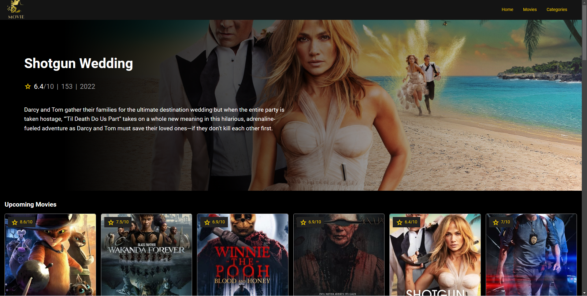

# MOVIE App

> This applicattion has information about movies

> App can run only localy on your computer.

## Description

The purpose of application is to fetch the movies and displaying them in nice way. It was build during the udemy course: Angular 15 - Beginner Practical Guide [2023] by Fadi Nouh

## How to run app

Run `ng serve` for a dev server. Navigate to `http://localhost:4200/`. The application will automatically reload if you change any of the source files.

## Features

- Navigation to different routes
- Animated slider baner with changing movies
- Display movies from three different categories
- Search movie
- Pagination
- Clicable card to see movie details
- Page with movie details
- Tabs component
- Carousel with Actors
- Display categories
- Choose movies by category
- Display movies by category
- Show movie trailers
- Show movie photos

## Built using

- Angular 15.1.1
- Typescript 4.8.4
- RxJS 7.5.7
- SCSS
- PrimeFlex
- PrimeNG
- [TMDB API](https://www.themoviedb.org/documentation/api "click to visit API website")
